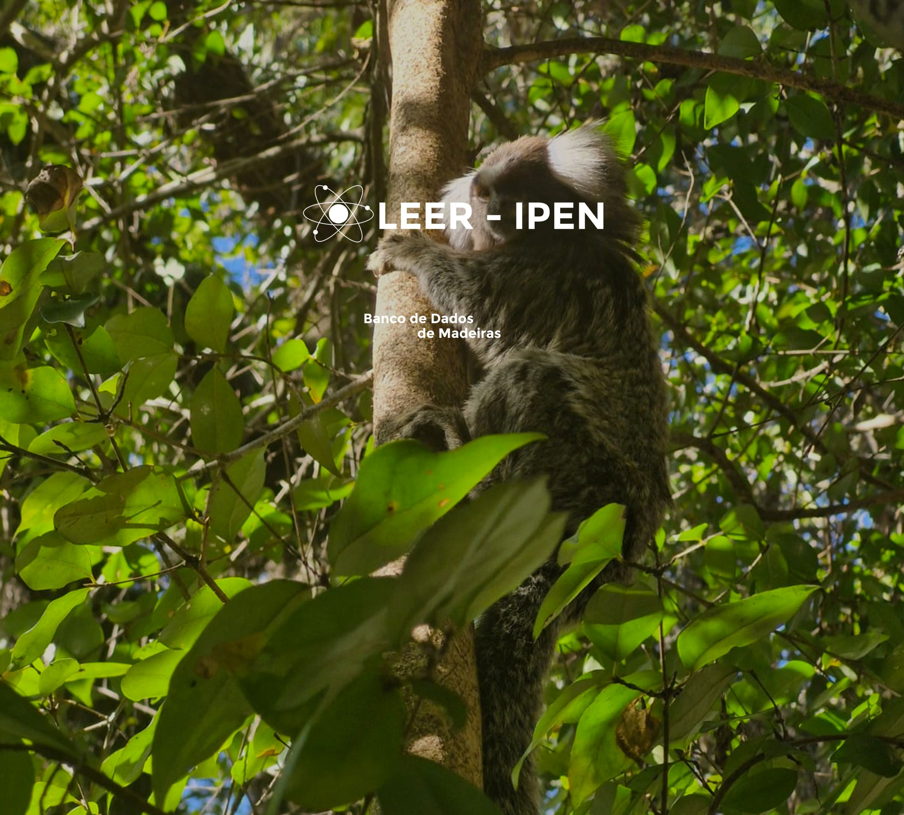
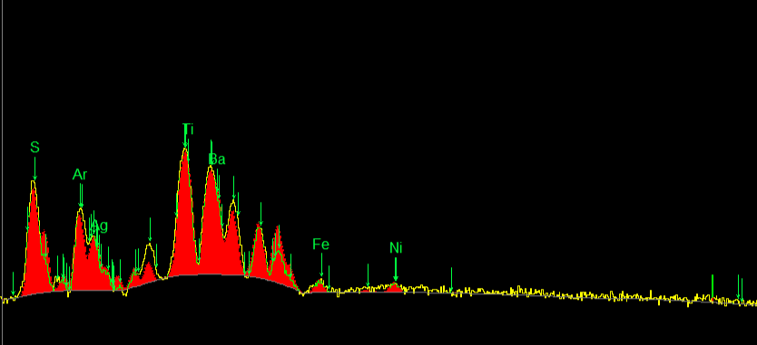

:::: {.container-texto}

  

#### O Projeto

Localizado no Instituto de Pesquisas Energéticas e Nucleares (IPEN), o Laboratório de Espectroscopia e Espectrometria das Radiações (LEER) realiza há alguns anos pesquisas de caracterização elementar de materiais pertencentes ao patrimônio Artístico e Cultural. Nesse sentido, o **Projeto Banco de Dados Madeiras** tem como objetivo armazenar informações técnicas de madeiras utilizadas em arte, possuindo fins de conservação e pesquisa científica. 

:::: {.carousel}

:::: {.carousel-item image="assets/imgs/discocompleto.jpeg" caption="Disco Completo"}
:::

:::: {.carousel-item image="assets/imgs/medidastransversais.jpeg" caption="Medidas Transversais"}
:::

:::: {.carousel-item image="assets/imgs/blococortado.jpeg" caption="Bloco Cortado"}
:::

:::

#### Dados Técnicos

O banco de dados possui estudos de caracterização elementar utilizando diferentes técnicas, como a Fluorescência de Raios - X (FRX) e a Análise por Ativação Neutrônica (AAN). Além disso, possui registro dos respectivos espectros e resultados das distribuições dos elementos em gráficos.

  

    Espectro de Fluorescência de Raios - X
  

  
  

    Fonte: do autor
  

#### Público-Alvo

O público-alvo são pesquisadores em conservação e restauro; artistas; estudantes de artes e química e todos que buscam um local centralizado para encontrar dados detalhados de caracterização elemental de madeiras artísticas.

  
  

    Foto de <a href="https://unsplash.com/pt-br/@thejmoore?utm_source=unsplash&utm_medium=referral&utm_content=creditCopyText">Jon Moore</a> na <a href="https://unsplash.com/pt-br/fotografias/fotografia-de-baixo-angulo-de-arvore-de-folhas-verdes-_2MyZDsUSM4?utm_source=unsplash&utm_medium=referral&utm_content=creditCopyText">Unsplash</a>
  

:::
